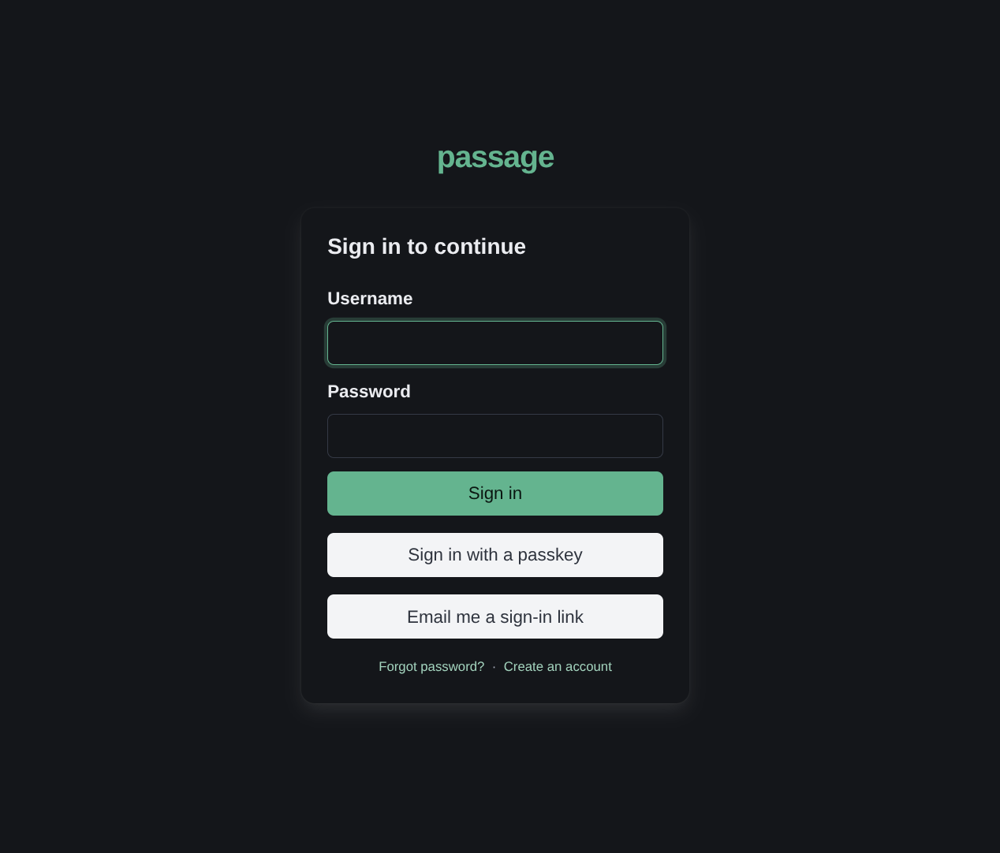
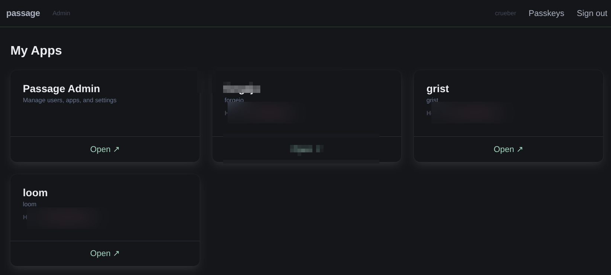
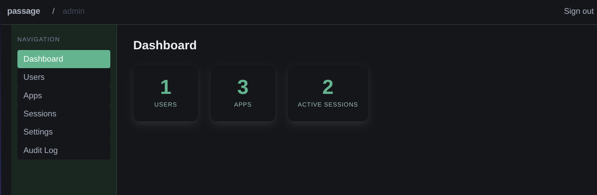
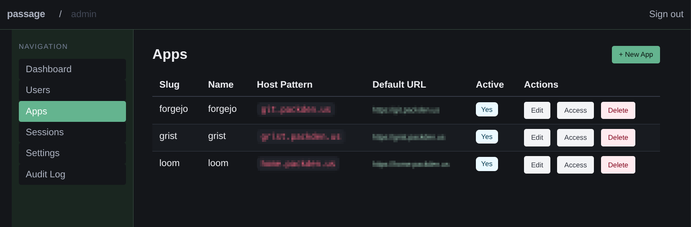
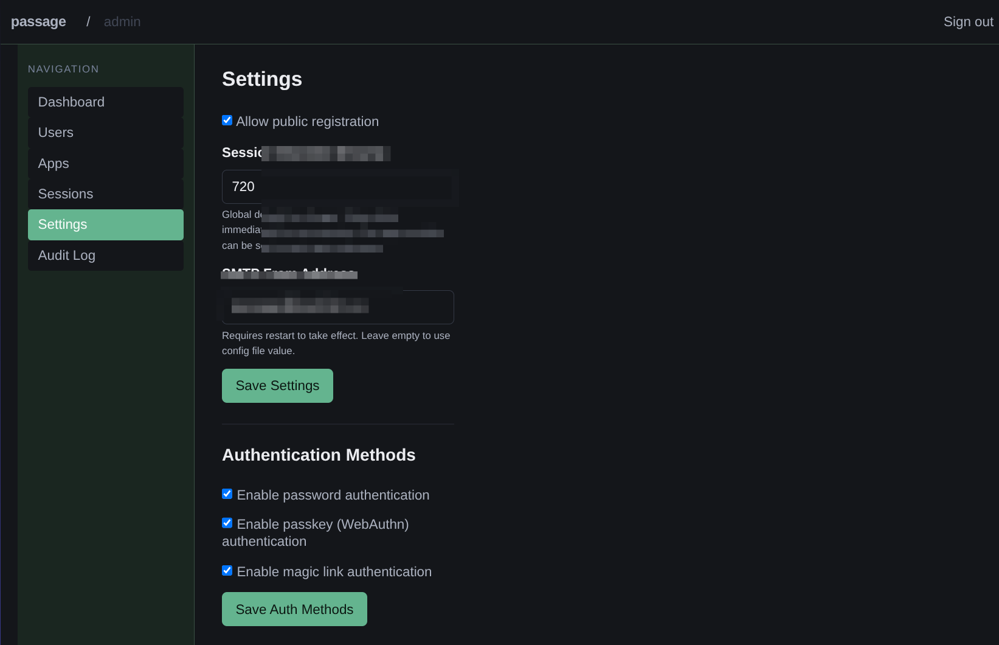

# Passage

A self-hosted authentication service for home labs. Passage provides a single front door for all your self-hosted applications — users log in once, and every app they access can trust that identity.

---

## Screenshots

<p align="center">
  <a href="screenshots/01-sign-in.png"></a>
  <a href="screenshots/02-my-apps.png"></a>
  <a href="screenshots/03-dashboard.png"></a>
  <a href="screenshots/04-apps.png"></a>
  <a href="screenshots/05-settings.png"></a>
</p>

---

## How it works

Passage is an **OAuth 2.0 / OpenID Connect (OIDC) identity provider**. Applications delegate authentication to Passage using the standard authorization code flow. Users log in at Passage and are redirected back to the application with a verified identity — no per-app login screens, no duplicated credential stores.

```
Browser → App → Passage /oauth/authorize → login → redirect back with code
              ↓
         App exchanges code for tokens → id_token contains verified user identity
```

Any application that speaks OAuth 2.0 or OIDC works out of the box: Grafana, Gitea, Nextcloud, Jellyfin, and hundreds more.

Passage also supports the **forward-auth pattern** for reverse proxies (Nginx, Traefik) as an alternative for applications with no built-in auth support — see [docs/forward-auth.md](docs/forward-auth.md).

---

## Features

The single biggest, most important feature: **simplicity**. Passage is built for homelabs, not enterprise deployment. It is not meant to have dozens of auth scopes, brandable screens, or complex policy engines. It is the front door — one place to log in, one place to manage who has access to what.

- **OAuth 2.0 / OIDC Provider** — act as an OpenID Connect identity provider for downstream apps; standard authorization code flow with `openid profile email` scopes
- **Username + password login** — bcrypt-hashed credentials stored in SQLite (cost configurable, default 12)
- **Passkeys (WebAuthn)** — register a platform authenticator or hardware key and log in without a password
- **Per-app access control** — grant or revoke each user's access to each registered application independently
- **Admin web UI** — manage users, apps, sessions, and settings without touching config files
- **Self-registration** — optionally let users create their own accounts (togglable by admin at runtime)
- **Email password reset** — single-use tokens, 1-hour expiry, sent via configurable SMTP
- **Session management** — DB-backed sessions with configurable duration; admin can revoke any session instantly
- **Single static binary** — no runtime dependencies, no CGo, no Docker required to run
- **SQLite backing store** — a single `.db` file; no separate database server

---

## Quick start

### Docker Compose (recommended)

The repository ships a ready-to-use `docker-compose.yml`. Copy the example env file, set your public URL, and start:

```bash
cp .env.example .env
# Edit .env — at minimum set PASSAGE_SERVER_BASE_URL
docker compose up -d
```

A minimal `docker-compose.yml` looks like this:

```yaml
services:
  passage:
    image: ghcr.io/crueber/passage:latest
    restart: unless-stopped
    ports:
      - "8080:8080"
    environment:
      PASSAGE_SERVER_BASE_URL: "https://auth.home.example.com"
      PASSAGE_DATABASE_PATH: "/data/passage.db"
      PASSAGE_SESSION_COOKIE_SECURE: "true"
      # SMTP — omit to disable email features
      PASSAGE_SMTP_HOST: "smtp.example.com"
      PASSAGE_SMTP_PORT: "587"
      PASSAGE_SMTP_USERNAME: "passage@example.com"
      PASSAGE_SMTP_PASSWORD: "secret"
      PASSAGE_SMTP_FROM: "Passage <passage@example.com>"
    volumes:
      - passage_data:/data
    healthcheck:
      test: ["CMD", "wget", "-qO-", "http://localhost:8080/healthz"]
      interval: 30s
      timeout: 5s
      start_period: 15s
      retries: 3

volumes:
  passage_data:
```

The full `docker-compose.yml` (with all environment variables and their defaults) is included in the repository.

On first start with an empty database, a one-time setup token is printed to stdout:

```
docker compose logs passage | grep setup
```

Visit `https://auth.home.example.com/setup` and use the token to create the first admin account. That endpoint disables itself as soon as an admin exists.

### Binary (no Docker)

```bash
# Build
CGO_ENABLED=0 go build -o passage ./cmd/passage

# Copy and edit the example config
cp passage.example.yaml passage.yaml
# edit passage.yaml — at minimum set server.base_url

# Run
./passage --config passage.yaml
```

The server starts on `0.0.0.0:8080` by default. Visit `http://localhost:8080/healthz` to confirm it is running.

---

## Configuration

Passage is configured via a YAML file plus `PASSAGE_*` environment variable overrides. Environment variables always take precedence over the file.

### Full configuration reference

```yaml
# passage.yaml — copy from passage.example.yaml and edit

server:
  host: "0.0.0.0"      # bind address
  port: 8080            # listen port
  base_url: "https://auth.home.example.com"  # required — used for email links, WebAuthn, and OIDC discovery

database:
  path: "./passage.db"  # path to SQLite file; created on first run

session:
  duration_hours: 24    # how long sessions stay valid
  cookie_name: "passage_session"
  cookie_secure: true   # set false only for local HTTP development

smtp:
  host: "smtp.example.com"
  port: 587
  username: "passage@example.com"
  password: "secret"
  from: "Passage <passage@example.com>"
  tls: "starttls"       # "starttls" | "tls" | "none"

auth:
  allow_registration: true  # allow users to self-register; togglable in admin UI at runtime
  bcrypt_cost: 12           # password hashing cost; 10–14 recommended

log:
  level: "info"    # "debug" | "info" | "warn" | "error"
  format: "json"   # "json" | "text"

csrf:
  key: ""          # optional server-side CSRF signing secret; must be 64+ hex chars (32+ random bytes)
                   # when set, CSRF tokens are bound to this secret in addition to the per-session cookie
                   # generate with: openssl rand -hex 32
                   # if unset, the double-submit cookie pattern is used (secure, but not server-bound)

rate_limit:
  login_requests: 10          # max login attempts per IP per window
  login_window_minutes: 15    # window duration for login limiter
  reset_requests: 5           # max password-reset requests per IP per window
  reset_window_minutes: 60    # window duration for reset limiter
  oauth_token_requests: 20    # max /oauth/token requests per IP per window
  oauth_token_window_minutes: 1  # window duration for oauth token limiter
  setup_requests: 5           # max /setup requests per IP per window
  setup_window_minutes: 60    # window duration for setup limiter
```

### Environment variable overrides

Every field has a corresponding `PASSAGE_` env var (prefix `PASSAGE_`, dots → underscores, uppercase). Examples:

| Variable | Overrides |
|---|---|
| `PASSAGE_SERVER_PORT` | `server.port` |
| `PASSAGE_SERVER_BASE_URL` | `server.base_url` |
| `PASSAGE_DATABASE_PATH` | `database.path` |
| `PASSAGE_SESSION_DURATION_HOURS` | `session.duration_hours` |
| `PASSAGE_SESSION_COOKIE_SECURE` | `session.cookie_secure` |
| `PASSAGE_SMTP_HOST` | `smtp.host` |
| `PASSAGE_SMTP_PASSWORD` | `smtp.password` |
| `PASSAGE_SMTP_TLS` | `smtp.tls` |
| `PASSAGE_AUTH_ALLOW_REGISTRATION` | `auth.allow_registration` |
| `PASSAGE_AUTH_BCRYPT_COST` | `auth.bcrypt_cost` |
| `PASSAGE_LOG_LEVEL` | `log.level` |
| `PASSAGE_LOG_FORMAT` | `log.format` |
| `PASSAGE_CSRF_KEY` | `csrf.key` — optional CSRF signing secret (64+ hex chars); strengthens CSRF protection by binding tokens to a server-side secret |
| `PASSAGE_RATELIMIT_LOGIN_REQUESTS` | `rate_limit.login_requests` |
| `PASSAGE_RATELIMIT_LOGIN_WINDOW_MINUTES` | `rate_limit.login_window_minutes` |
| `PASSAGE_RATELIMIT_RESET_REQUESTS` | `rate_limit.reset_requests` |
| `PASSAGE_RATELIMIT_RESET_WINDOW_MINUTES` | `rate_limit.reset_window_minutes` |
| `PASSAGE_RATELIMIT_OAUTH_TOKEN_REQUESTS` | `rate_limit.oauth_token_requests` |
| `PASSAGE_RATELIMIT_OAUTH_TOKEN_WINDOW_MINUTES` | `rate_limit.oauth_token_window_minutes` |
| `PASSAGE_RATELIMIT_SETUP_REQUESTS` | `rate_limit.setup_requests` |
| `PASSAGE_RATELIMIT_SETUP_WINDOW_MINUTES` | `rate_limit.setup_window_minutes` |

---

## OAuth 2.0 / OIDC Provider

Passage acts as an OpenID Connect identity provider for downstream applications (Grafana, Gitea, Nextcloud, etc.) using the standard authorization code flow.

> **Requirement**: `server.base_url` (or `PASSAGE_SERVER_BASE_URL`) must be set to Passage's public URL for OIDC discovery to work correctly.

### Endpoints

| Endpoint | Method | Description |
|---|---|---|
| `/.well-known/openid-configuration` | `GET` | OIDC discovery document |
| `/.well-known/jwks.json` | `GET` | JSON Web Key Set (RSA public key for id_token verification) |
| `/oauth/authorize` | `GET` | Authorization endpoint — redirects to login if no session |
| `/oauth/token` | `POST` | Token endpoint — `authorization_code` and `refresh_token` grants |
| `/oauth/userinfo` | `GET` | UserInfo endpoint — requires `Bearer` access token |

The RSA signing key is auto-generated on first start and stored in the database — no manual key management is required.

### Setting up a client

1. In the Passage admin UI, open an application and enable OAuth. Generate OAuth credentials to receive a `client_id` and `client_secret`.
2. Add the downstream app's callback URL(s) as allowed redirect URIs.
3. Configure the downstream application with the `client_id`, `client_secret`, and Passage's `base_url` as the issuer.

### Grafana example (Generic OAuth)

```ini
[auth.generic_oauth]
enabled           = true
name              = Passage
client_id         = <your-client-id>
client_secret     = <your-client-secret>
scopes            = openid profile email
auth_url          = https://auth.home.example.com/oauth/authorize
token_url         = https://auth.home.example.com/oauth/token
api_url           = https://auth.home.example.com/oauth/userinfo
use_id_token      = true
# Map Passage is_admin claim to Grafana admin role (optional)
role_attribute_path = is_admin && 'Admin' || 'Viewer'
```

id_tokens are signed with RS256. Grafana (and any OIDC-compliant library) can verify them automatically via the JWKS endpoint.

---

## Forward-auth (reverse proxy)

For applications without native OAuth/OIDC support, Passage supports the forward-auth pattern with Nginx and Traefik. See [docs/forward-auth.md](docs/forward-auth.md) for setup instructions.

---

## Development

### Requirements

- Go 1.22 or later
- `CGO_ENABLED=0` — no CGo, ever

### Build

```bash
# Standard build
CGO_ENABLED=0 go build -o passage ./cmd/passage

# With version injected
CGO_ENABLED=0 go build -ldflags "-X main.version=0.1.0" -o passage ./cmd/passage
```

### Test

```bash
# All tests with race detector (required)
go test -race ./...

# Single package
go test -race ./internal/user/...
go test -race ./internal/session/...
go test -race ./internal/app/...
go test -race ./internal/forwardauth/...
go test -race ./internal/admin/...
go test -race ./internal/webauthn/...
go test -race ./internal/oauth/...
```

Tests use a real in-memory SQLite database — no mocks at the database layer. The `internal/testutil` package provides `NewTestDB(t)` for setting up a fully migrated test database.

### Vet and tidy

```bash
go vet ./...
go mod tidy
```

### Full pre-commit checklist

```bash
CGO_ENABLED=0 go build ./...
go vet ./...
go test -race ./...
go mod tidy && git diff --exit-code go.mod go.sum
```

---

## Security audit notes

- **Passwords**: bcrypt, minimum cost 10, default 12. Minimum password length: 8 characters.
- **Session tokens**: 32 bytes of `crypto/rand` entropy (64-char hex). Never `math/rand`.
- **Reset tokens**: 32 bytes of `crypto/rand`. Single-use (`used_at` stamped on redeem). 1-hour TTL.
- **Cookies**: `HttpOnly`, `Secure` (configurable for HTTP dev), `SameSite=Lax`.
- **CSRF**: All mutations use POST with a synchronizer token (`_csrf` hidden field, or `HX-CSRF-Token` header for htmx). On authenticated routes the token is HMAC-signed with the session token; on anonymous routes (login, register, reset) a double-submit cookie pattern is used. Setting `PASSAGE_CSRF_KEY` binds anonymous tokens to a server-side secret for defence against subdomain attacks. `SameSite=Lax` is an additional layer.
- **SQL**: All queries use parameterized statements — no string concatenation in SQL.
- **Templates**: `html/template` auto-escaping on all rendered output — no `template.HTML()` bypasses.
- **Admin routes**: `is_admin` checked against the database on every admin request; not cached.

---

## Acknowledgements

Passage is built on the shoulders of these excellent open-source projects:

- [go-chi/chi](https://github.com/go-chi/chi) — lightweight, idiomatic Go HTTP router
- [pressly/goose](https://github.com/pressly/goose) — database migration tool
- [wneessen/go-mail](https://github.com/wneessen/go-mail) — modern Go mail library
- [golang.org/x/crypto](https://pkg.go.dev/golang.org/x/crypto) — Go supplementary cryptography libraries
- [modernc.org/sqlite](https://gitlab.com/cznic/sqlite) — pure-Go SQLite driver (no CGo)
- [go-webauthn/webauthn](https://github.com/go-webauthn/webauthn) — WebAuthn/passkeys library for Go
- [gopkg.in/yaml.v3](https://github.com/go-yaml/yaml) — YAML support for Go
- [Bulma](https://bulma.io) — modern CSS framework based on Flexbox (v1.0.2)
- [htmx](https://htmx.org) — high power tools for HTML

---

## License

MIT — see [LICENSE](LICENSE)
